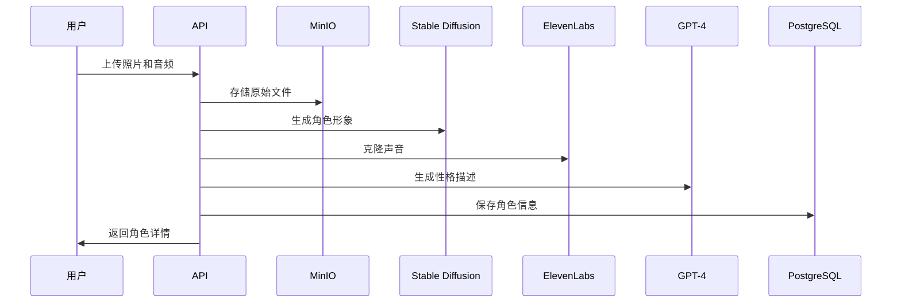
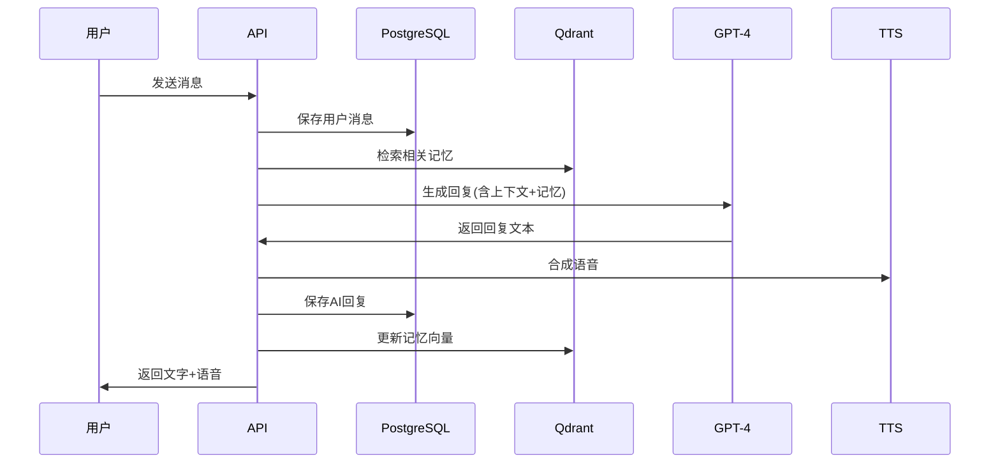

# 永伴 - AI情感陪伴系统技术架构

## 1. 系统概述

永伴是一款面向中老年群体的AI情感陪伴产品，通过AI技术复刻"熟悉的人"，提供长期情感陪伴服务。

## 2. 核心功能模块

### 2.1 用户管理模块
- 用户注册/登录
- 用户资料管理
- 订阅管理（免费版/付费版）
- 权限控制

### 2.2 角色管理模块
- 角色创建（上传照片、音频、文字描述）
- AI生成角色形象（基于照片）
- AI生成角色声音（基于音频样本）
- 角色性格设定
- 角色关系标签（父母、朋友、伴侣等）

### 2.3 对话系统
- 文字对话
- 语音对话（语音识别 + TTS）
- 上下文理解
- 情感分析
- 多轮对话管理

### 2.4 记忆系统
- 短期记忆（当前对话上下文）
- 长期记忆（用户习惯、重要事件）
- 向量化存储和检索
- 记忆重要性评分

### 2.5 主动关怀系统
- 定时提醒（健康、天气、日程）
- 智能触发（基于用户行为）
- 节日问候
- 情绪关怀

### 2.6 内容管理
- 对话历史
- 回忆录生成
- 语音/图片归档
- 数据导出

## 3. 技术架构

### 3.1 整体架构图

```
┌─────────────────────────────────────────────────────────────┐
│                         客户端层                              │
│  ┌──────────────┐  ┌──────────────┐  ┌──────────────┐      │
│  │ 微信小程序    │  │   Web应用    │  │  移动APP     │      │
│  └──────────────┘  └──────────────┘  └──────────────┘      │
└────────────────────────┬────────────────────────────────────┘
                         │ HTTPS/WSS
┌────────────────────────┴────────────────────────────────────┐
│                      API网关层                                │
│              ┌─────────────────────────┐                     │
│              │   FastAPI + Nginx       │                     │
│              │  - 认证/鉴权            │                     │
│              │  - 限流/熔断            │                     │
│              │  - 负载均衡            │                     │
│              └─────────────────────────┘                     │
└────────────────────────┬────────────────────────────────────┘
                         │
┌────────────────────────┴────────────────────────────────────┐
│                      应用服务层                               │
│  ┌──────────┐  ┌──────────┐  ┌──────────┐  ┌──────────┐   │
│  │用户服务  │  │角色服务  │  │对话服务  │  │记忆服务  │   │
│  └──────────┘  └──────────┘  └──────────┘  └──────────┘   │
│  ┌──────────┐  ┌──────────┐  ┌──────────┐  ┌──────────┐   │
│  │关怀服务  │  │媒体服务  │  │分析服务  │  │订阅服务  │   │
│  └──────────┘  └──────────┘  └──────────┘  └──────────┘   │
└────────────────────────┬────────────────────────────────────┘
                         │
┌────────────────────────┴────────────────────────────────────┐
│                      AI服务层                                 │
│  ┌────────────────┐  ┌────────────────┐  ┌───────────────┐ │
│  │  GPT-4 API     │  │  Stable        │  │  TTS服务      │ │
│  │  (对话生成)    │  │  Diffusion     │  │  (语音合成)   │ │
│  │                │  │  (图像生成)    │  │               │ │
│  └────────────────┘  └────────────────┘  └───────────────┘ │
│  ┌────────────────┐  ┌────────────────┐  ┌───────────────┐ │
│  │  Whisper API   │  │  Embedding     │  │  情感分析     │ │
│  │  (语音识别)    │  │  (向量化)      │  │  API          │ │
│  └────────────────┘  └────────────────┘  └───────────────┘ │
└────────────────────────┬────────────────────────────────────┘
                         │
┌────────────────────────┴────────────────────────────────────┐
│                      数据层                                   │
│  ┌────────────────┐  ┌────────────────┐  ┌───────────────┐ │
│  │  PostgreSQL    │  │  Qdrant/       │  │  Redis        │ │
│  │  (关系数据)    │  │  Pinecone      │  │  (缓存)       │ │
│  │                │  │  (向量数据库)  │  │               │ │
│  └────────────────┘  └────────────────┘  └───────────────┘ │
│  ┌────────────────┐  ┌────────────────┐                     │
│  │  MinIO/S3      │  │  Celery +      │                     │
│  │  (对象存储)    │  │  RabbitMQ      │                     │
│  │                │  │  (任务队列)    │                     │
│  └────────────────┘  └────────────────┘                     │
└─────────────────────────────────────────────────────────────┘
```

### 3.2 技术栈选型

#### 后端技术栈
- **Web框架**: FastAPI (Python 3.11+)
  - 高性能异步框架
  - 自动生成API文档
  - 类型检查支持
  - WebSocket支持

- **数据库**:
  - PostgreSQL 15+ (主数据库)
  - Qdrant (向量数据库 - 本地部署)
  - Redis 7+ (缓存、会话)

- **任务队列**: Celery + RabbitMQ
  - 异步任务处理
  - 定时任务调度

- **对象存储**: MinIO (兼容S3)
  - 图片、音频存储
  - 私有化部署

#### AI服务选型
- **对话AI**: OpenAI GPT-4
  - 备选：Claude 3 / 通义千问 / 文心一言

- **图像生成**:
  - Stable Diffusion XL (Stability AI)
  - 备选：DALL-E 3 / Midjourney API

- **语音合成**:
  - ElevenLabs (高质量克隆)
  - Azure TTS (稳定可靠)
  - 科大讯飞 (中文优化)

- **语音识别**:
  - Whisper API (OpenAI)
  - 备选：Azure Speech to Text

- **向量嵌入**:
  - OpenAI Embedding (text-embedding-3-large)
  - 备选：M3E / BGE (中文优化)

#### 前端技术栈（未来扩展）
- **微信小程序**:
  - 原生微信小程序开发
  - uniapp (跨平台考虑)

- **Web应用**:
  - React / Vue 3
  - TailwindCSS

#### DevOps
- **容器化**: Docker + Docker Compose
- **CI/CD**: GitHub Actions
- **监控**: Prometheus + Grafana
- **日志**: ELK Stack / Loki

## 4. 数据模型设计

### 4.1 核心数据表

#### users (用户表)
```sql
CREATE TABLE users (
    id SERIAL PRIMARY KEY,
    phone VARCHAR(20) UNIQUE NOT NULL,
    nickname VARCHAR(50),
    avatar_url TEXT,
    birth_date DATE,
    gender VARCHAR(10),
    subscription_type VARCHAR(20) DEFAULT 'free', -- free, premium
    subscription_expires_at TIMESTAMP,
    created_at TIMESTAMP DEFAULT CURRENT_TIMESTAMP,
    updated_at TIMESTAMP DEFAULT CURRENT_TIMESTAMP,
    last_login_at TIMESTAMP
);
```

#### companions (陪伴角色表)
```sql
CREATE TABLE companions (
    id SERIAL PRIMARY KEY,
    user_id INTEGER REFERENCES users(id) ON DELETE CASCADE,
    name VARCHAR(50) NOT NULL,
    relationship VARCHAR(20), -- parent, spouse, friend, child
    avatar_url TEXT,
    voice_id VARCHAR(100), -- TTS服务的voice ID
    personality JSONB, -- 性格特征
    background_story TEXT, -- 背景故事
    system_prompt TEXT, -- AI系统提示词
    is_active BOOLEAN DEFAULT true,
    created_at TIMESTAMP DEFAULT CURRENT_TIMESTAMP,
    updated_at TIMESTAMP DEFAULT CURRENT_TIMESTAMP
);
```

#### conversations (对话会话表)
```sql
CREATE TABLE conversations (
    id SERIAL PRIMARY KEY,
    user_id INTEGER REFERENCES users(id) ON DELETE CASCADE,
    companion_id INTEGER REFERENCES companions(id) ON DELETE CASCADE,
    title VARCHAR(100),
    started_at TIMESTAMP DEFAULT CURRENT_TIMESTAMP,
    last_message_at TIMESTAMP,
    message_count INTEGER DEFAULT 0
);
```

#### messages (消息表)
```sql
CREATE TABLE messages (
    id SERIAL PRIMARY KEY,
    conversation_id INTEGER REFERENCES conversations(id) ON DELETE CASCADE,
    role VARCHAR(20) NOT NULL, -- user, assistant, system
    content TEXT NOT NULL,
    content_type VARCHAR(20) DEFAULT 'text', -- text, audio, image
    audio_url TEXT,
    emotion VARCHAR(20), -- happy, sad, neutral, etc.
    created_at TIMESTAMP DEFAULT CURRENT_TIMESTAMP
);
```

#### memories (长期记忆表)
```sql
CREATE TABLE memories (
    id SERIAL PRIMARY KEY,
    user_id INTEGER REFERENCES users(id) ON DELETE CASCADE,
    companion_id INTEGER REFERENCES companions(id) ON DELETE CASCADE,
    memory_type VARCHAR(20), -- fact, event, preference, relationship
    content TEXT NOT NULL,
    importance_score FLOAT DEFAULT 0.5, -- 0-1
    embedding_id VARCHAR(100), -- 向量数据库中的ID
    source_message_id INTEGER REFERENCES messages(id),
    created_at TIMESTAMP DEFAULT CURRENT_TIMESTAMP,
    last_accessed_at TIMESTAMP
);
```

#### care_schedules (关怀计划表)
```sql
CREATE TABLE care_schedules (
    id SERIAL PRIMARY KEY,
    user_id INTEGER REFERENCES users(id) ON DELETE CASCADE,
    companion_id INTEGER REFERENCES companions(id) ON DELETE CASCADE,
    schedule_type VARCHAR(20), -- daily, weekly, monthly, event
    time_pattern VARCHAR(50), -- cron表达式
    message_template TEXT,
    is_enabled BOOLEAN DEFAULT true,
    created_at TIMESTAMP DEFAULT CURRENT_TIMESTAMP
);
```

#### media_assets (媒体资源表)
```sql
CREATE TABLE media_assets (
    id SERIAL PRIMARY KEY,
    user_id INTEGER REFERENCES users(id) ON DELETE CASCADE,
    file_type VARCHAR(20), -- image, audio, video
    file_url TEXT NOT NULL,
    file_size INTEGER,
    mime_type VARCHAR(50),
    purpose VARCHAR(50), -- avatar, voice_sample, memory
    metadata JSONB,
    created_at TIMESTAMP DEFAULT CURRENT_TIMESTAMP
);
```

### 4.2 向量数据库结构 (Qdrant)

```python
# Collection: user_memories
{
    "id": "uuid",
    "vector": [0.1, 0.2, ...], # 1536维向量
    "payload": {
        "user_id": 123,
        "companion_id": 456,
        "memory_id": 789,
        "content": "用户喜欢早上8点喝咖啡",
        "memory_type": "preference",
        "importance": 0.8,
        "timestamp": "2025-10-24T10:00:00Z"
    }
}
```

## 5. API设计

### 5.1 RESTful API端点

#### 认证相关
- `POST /api/v1/auth/register` - 用户注册
- `POST /api/v1/auth/login` - 用户登录
- `POST /api/v1/auth/logout` - 用户登出
- `POST /api/v1/auth/refresh` - 刷新token

#### 用户管理
- `GET /api/v1/users/me` - 获取当前用户信息
- `PUT /api/v1/users/me` - 更新用户信息
- `GET /api/v1/users/me/subscription` - 获取订阅信息

#### 角色管理
- `POST /api/v1/companions` - 创建陪伴角色
- `GET /api/v1/companions` - 获取角色列表
- `GET /api/v1/companions/{id}` - 获取角色详情
- `PUT /api/v1/companions/{id}` - 更新角色信息
- `DELETE /api/v1/companions/{id}` - 删除角色
- `POST /api/v1/companions/{id}/avatar` - 上传/生成头像
- `POST /api/v1/companions/{id}/voice` - 上传/克隆声音

#### 对话相关
- `GET /api/v1/conversations` - 获取对话列表
- `POST /api/v1/conversations` - 创建新对话
- `GET /api/v1/conversations/{id}` - 获取对话详情
- `DELETE /api/v1/conversations/{id}` - 删除对话
- `POST /api/v1/conversations/{id}/messages` - 发送消息
- `GET /api/v1/conversations/{id}/messages` - 获取消息历史

#### 语音交互
- `POST /api/v1/voice/speech-to-text` - 语音转文字
- `POST /api/v1/voice/text-to-speech` - 文字转语音

#### 记忆管理
- `GET /api/v1/memories` - 获取记忆列表
- `POST /api/v1/memories` - 创建记忆
- `DELETE /api/v1/memories/{id}` - 删除记忆

#### 关怀计划
- `GET /api/v1/care-schedules` - 获取关怀计划
- `POST /api/v1/care-schedules` - 创建关怀计划
- `PUT /api/v1/care-schedules/{id}` - 更新计划
- `DELETE /api/v1/care-schedules/{id}` - 删除计划

### 5.2 WebSocket API

#### 实时对话
```
WS /api/v1/ws/chat/{conversation_id}

发送:
{
    "type": "message",
    "content": "你好，今天怎么样？",
    "content_type": "text"
}

接收:
{
    "type": "message",
    "content": "我很好，谢谢关心！你呢？",
    "emotion": "happy",
    "audio_url": "https://..."
}
```

## 6. 核心业务流程

### 6.1 角色创建流程



### 6.2 对话流程



### 6.3 记忆提取流程

```
用户消息 -> 情感分析 -> 重要性评分 ->
信息提取 -> 向量化 -> 存储到Qdrant ->
关联到PostgreSQL
```

### 6.4 主动关怀流程

```
Celery定时任务 -> 检查关怀计划 ->
获取用户上下文 -> 检索相关记忆 ->
生成关怀消息 -> 推送通知 ->
记录到对话历史
```

## 7. 安全与隐私

### 7.1 数据安全
- 所有API使用HTTPS
- JWT token认证
- 密码使用bcrypt加密
- 敏感数据字段级加密

### 7.2 隐私保护
- 用户数据隔离
- 上传文件病毒扫描
- 音频/图片水印
- 数据访问审计日志

### 7.3 AI安全
- 内容过滤（敏感信息、违规内容）
- Prompt注入防护
- 调用频率限制
- 异常检测与告警

## 8. 性能优化

### 8.1 缓存策略
- Redis缓存用户信息
- 对话上下文缓存（30分钟）
- API响应缓存

### 8.2 异步处理
- 图像生成异步
- 语音合成异步
- 记忆向量化异步

### 8.3 数据库优化
- 索引优化
- 分页查询
- 读写分离（未来）

## 9. 监控与运维

### 9.1 监控指标
- API响应时间
- AI服务调用成功率
- 错误率和异常
- 用户活跃度
- 对话质量评分

### 9.2 告警机制
- API异常告警
- AI服务失败告警
- 数据库性能告警
- 存储空间告警

## 10. MVP开发优先级

### Phase 1: 核心功能 (2-3周)
1. 用户注册/登录
2. 角色创建（基础版）
3. 文字对话
4. 基础记忆系统

### Phase 2: AI增强 (2-3周)
1. 图像生成集成
2. 语音合成集成
3. 向量记忆系统
4. 情感分析

### Phase 3: 高级功能 (2-3周)
1. 语音对话
2. 主动关怀
3. 订阅系统
4. 回忆录功能

### Phase 4: 优化与上线 (1-2周)
1. 性能优化
2. 安全加固
3. 监控部署
4. 文档完善

## 11. 成本估算

### 11.1 AI服务成本（每用户/月）
- GPT-4对话: $2-5
- 图像生成: $0.5-1
- 语音合成: $1-2
- 语音识别: $0.5-1
- **总计**: $4-9/用户/月

### 11.2 基础设施成本
- 云服务器: $50-200/月
- 数据库: $30-100/月
- 对象存储: $10-50/月
- CDN: $20-80/月
- **总计**: $110-430/月

### 11.3 盈利模型
- 订阅价格: ¥49-69/月
- AI成本: ¥30-60/月
- 毛利率: 40-60%
- 盈亏平衡: 1000+付费用户

## 12. 技术风险与应对

### 12.1 AI服务依赖
- **风险**: 第三方API不稳定
- **应对**: 多服务商备份、本地模型备选

### 12.2 成本控制
- **风险**: AI调用成本过高
- **应对**: 缓存策略、智能降级、用量限制

### 12.3 数据隐私
- **风险**: 敏感数据泄露
- **应对**: 加密存储、访问控制、合规审计

### 12.4 情感依赖
- **风险**: 用户过度依赖AI
- **应对**: 健康提醒、使用时长限制、心理支持

## 13. 下一步行动

1. ✅ 搭建开发环境
2. ✅ 设计数据库schema
3. 🚧 实现后端API框架
4. 🚧 集成AI服务
5. 🚧 开发前端界面
6. 🚧 测试与优化
7. 🚧 部署上线

---

**文档版本**: v1.0
**更新日期**: 2025-10-24
**负责人**: 技术团队
